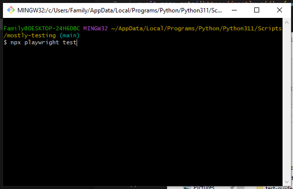
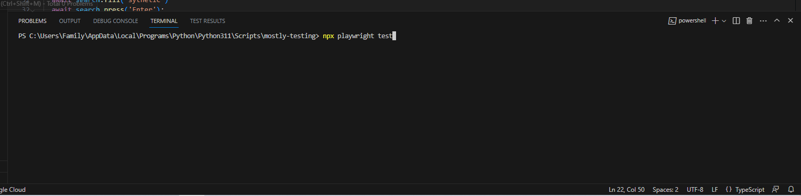
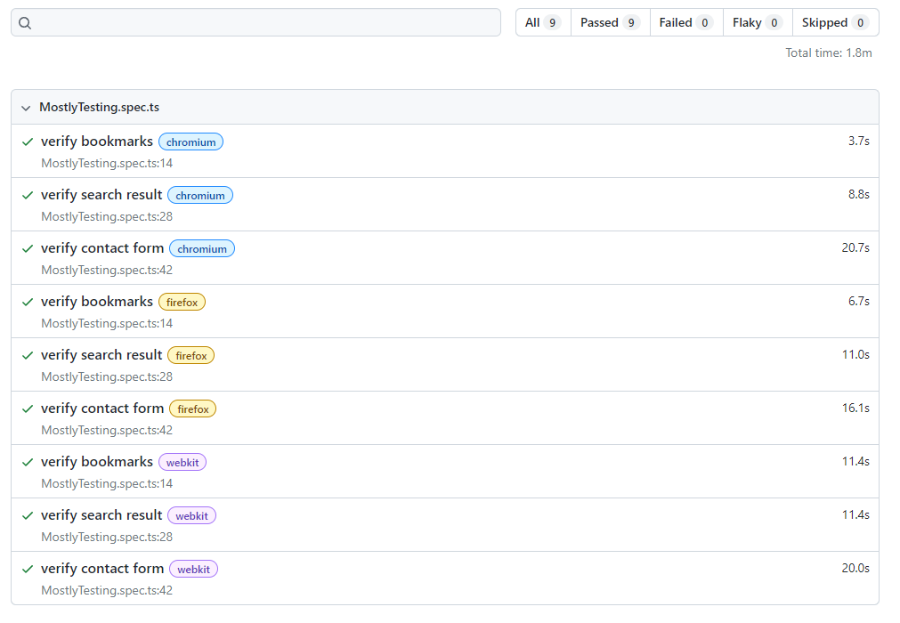

For this task, I chose to use Playwright for its ease of use as well as straightforward reporting.

#### GUIDE TO RUNNING A TEST
1. Navigate to the repository on Github and clone into your local machine: https://github.com/mvs9/mostly-testing
2. The main test is in the tests folder, under MostlyTesting.spec.ts with three test methods, 'verify bookmarks', 'verify search result' and 'verify contact form'
3. Open a terminal either by:
    - opening the folder in VS Code and creating a new terminal 
    - right clicking on the folder in file explorer and opening a terminal (in the example below, I used Git Bash)
4. Install the dependencies required to run the test using `npm install`
5. Once installed, use the below command to run the test 'MostlyTesting.spec.ts'
  
`npx playwright test`

If that doesn't work, try:
`npx playwright test MostlyTesting.spec.ts`

#### GUIDE TO PRODUCING A REPORT

You can find a report under 'MostlyTesting/playwright-report' either by: 
1. Running the below command to 
`npx playwright show-report test-report`

2. Copying the path of the file test-report/index.html into your browser.

This should open up a webpage showing the three tests that ran in Chromium, Firefox and Webkit.

If you want to create a new report, run the command below. This will create a new test report in folder 'playwright-report'.

`npx playwright test --reporter=html`
